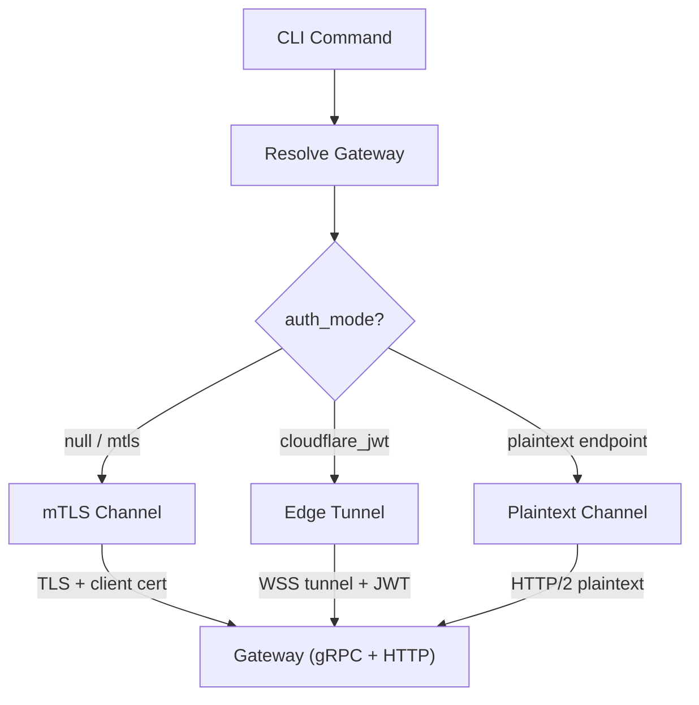
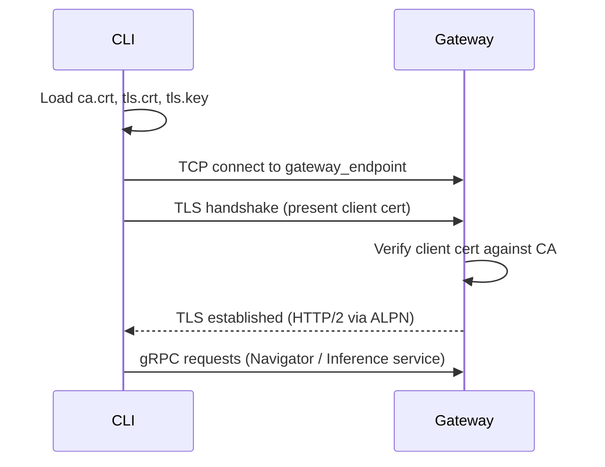
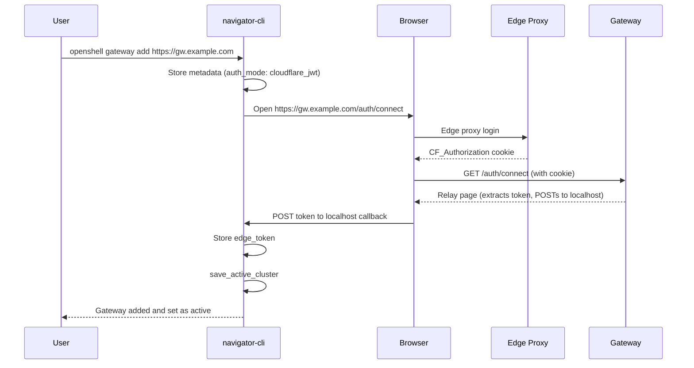

# Gateway Communication

## Overview

This document describes how the CLI resolves a gateway and communicates with it once the endpoint already exists. The gateway exposes gRPC and HTTP services on a single multiplexed port, and the CLI chooses one of three connection modes: direct mTLS, edge-authenticated WebSocket tunnel, or plaintext HTTP/2 behind a trusted proxy.

## Connection Flow

### Gateway resolution

When any CLI command needs to talk to the gateway, it resolves the target through a priority chain (`crates/navigator-cli/src/main.rs` -- `resolve_gateway()`):

1. `--gateway-endpoint <URL>` flag (direct URL, reusing stored metadata when the gateway is known).
2. `--cluster <NAME>` / `-g <NAME>` flag.
3. `OPENSHELL_GATEWAY` environment variable.
4. Active gateway from `~/.config/openshell/active_gateway`.

Resolution loads `ClusterMetadata` from disk to get the `gateway_endpoint` URL and `auth_mode`. When `--gateway-endpoint` is used, the CLI still tries to match the URL to stored metadata so edge auth tokens and TLS bundles continue to resolve by cluster name.

### Connection modes



### mTLS connection (default)

**File**: `crates/navigator-cli/src/tls.rs` -- `build_channel()`

The default mode for self-deployed gateways. The CLI loads three PEM files from `~/.config/openshell/clusters/<name>/mtls/`:

| File      | Purpose                                                        |
| --------- | -------------------------------------------------------------- |
| `ca.crt`  | Cluster CA certificate -- verifies the gateway's server cert   |
| `tls.crt` | Client certificate -- proves the CLI's identity to the gateway |
| `tls.key` | Client private key                                             |

These are used to build a `tonic::transport::ClientTlsConfig`, which configures a `tonic::transport::Channel` for gRPC communication over HTTP/2 with mTLS.



### Edge-authenticated connection

**Files**: `crates/navigator-cli/src/edge_tunnel.rs`, `crates/navigator-cli/src/auth.rs`

For gateways behind an edge proxy (e.g., Cloudflare Access), the CLI routes traffic through a local WebSocket tunnel proxy:

1. `start_tunnel_proxy()` binds an ephemeral local TCP port.
2. Opens a WebSocket connection (`wss://<gateway>/_ws_tunnel`) to the edge with the stored bearer token in headers.
3. The gateway's `ws_tunnel.rs` handler upgrades the WebSocket and bridges it to an in-memory `MultiplexService` instance.
4. The gRPC channel connects to `http://127.0.0.1:<local_port>` (plaintext HTTP/2 over the tunnel).

Authentication uses a browser-based flow: `gateway add` opens the user's browser to the gateway's `/auth/connect` endpoint, which reads the `CF_Authorization` cookie and relays it back to a localhost callback server. The token is stored at `~/.config/openshell/clusters/<name>/edge_token`.

### Plaintext connection

When the gateway is deployed with `--plaintext`, TLS is disabled entirely. The CLI connects over plain HTTP/2. This mode is intended for gateways behind a trusted reverse proxy or tunnel that handles TLS termination.

## File System Layout

All connection artifacts are stored under `$XDG_CONFIG_HOME/openshell/` (default `~/.config/openshell/`):

```
openshell/
  active_cluster                          # plain text: active cluster name
  clusters/
    <name>_metadata.json                  # ClusterMetadata JSON
    <name>/
      mtls/                               # mTLS bundle (when TLS enabled)
        ca.crt                            # cluster CA certificate
        tls.crt                           # client certificate
        tls.key                           # client private key
      edge_token                          # Edge auth JWT (when auth_mode=cloudflare_jwt)
```

## Registering an Edge-Authenticated Gateway

For gateways that are already deployed behind an edge proxy (e.g., Cloudflare Access), deployment is not needed -- only registration.

**File**: `crates/navigator-cli/src/run.rs` -- `gateway_add()`


