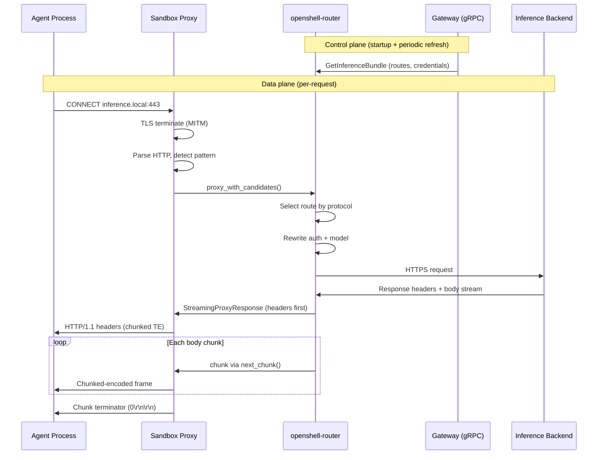

# Inference Routing

Inference routing gives sandboxed agents access to LLM APIs through a single, explicit endpoint: `inference.local`. There is no implicit catch-all interception for arbitrary hosts. Requests are routed only when the process targets `inference.local` via HTTPS and the request matches a supported inference API pattern.

All inference execution happens locally inside the sandbox via the `openshell-router` crate. The gateway is control-plane only: it stores configuration and delivers resolved route bundles to sandboxes over gRPC.

## Architecture Overview



## Provider Profiles

File: `crates/openshell-core/src/inference.rs`

`InferenceProviderProfile` is the single source of truth for provider-specific inference knowledge: default endpoint, supported protocols, credential key lookup order, auth header style, and default headers.

Three profiles are defined:

| Provider | Default Base URL | Protocols | Auth | Default Headers |
|----------|-----------------|-----------|------|-----------------|
| `openai` | `https://api.openai.com/v1` | `openai_chat_completions`, `openai_completions`, `openai_responses`, `model_discovery` | `Authorization: Bearer` | (none) |
| `anthropic` | `https://api.anthropic.com/v1` | `anthropic_messages`, `model_discovery` | `x-api-key` | `anthropic-version: 2023-06-01` |
| `nvidia` | `https://integrate.api.nvidia.com/v1` | `openai_chat_completions`, `openai_completions`, `openai_responses`, `model_discovery` | `Authorization: Bearer` | (none) |

Each profile also defines `credential_key_names` (e.g. `["OPENAI_API_KEY"]`) and `base_url_config_keys` (e.g. `["OPENAI_BASE_URL"]`) used by the gateway to resolve credentials and endpoint overrides from provider records.

Unknown provider types return `None` from `profile_for()` and default to `Bearer` auth with no default headers via `auth_for_provider_type()`.

## Control Plane (Gateway)

File: `crates/openshell-server/src/inference.rs`

The gateway implements the `Inference` gRPC service defined in `proto/inference.proto`.

### Cluster inference set/get

`SetClusterInference` takes a `provider_name` and `model_id`. It:

1. Validates that both fields are non-empty.
2. Fetches the named provider record from the store.
3. Validates the provider by resolving its route (checking that the provider type is supported and has a usable API key).
4. By default, performs a lightweight provider-shaped probe against the resolved upstream endpoint (for example, a tiny chat/messages request with `max_tokens: 1`) to confirm the endpoint is reachable and accepts the expected auth/request shape. `--no-verify` disables this probe when the endpoint is not up yet.
5. Builds a managed route spec that stores only `provider_name` and `model_id`. The spec intentionally leaves `base_url`, `api_key`, and `protocols` empty -- these are resolved dynamically at bundle time from the provider record.
6. Upserts the route with name `inference.local`. Version starts at 1 and increments monotonically on each update.

`GetClusterInference` returns `provider_name`, `model_id`, and `version` for the managed route. Returns `NOT_FOUND` if cluster inference is not configured.

### Bundle delivery

`GetInferenceBundle` resolves the managed route at request time:

1. Loads the `inference.local` route from the store.
2. Looks up the referenced provider record by `provider_name`.
3. Resolves endpoint, API key, protocols, and provider type from the provider record using the `InferenceProviderProfile` registry.
4. If the provider's config map contains a base URL override key (e.g. `OPENAI_BASE_URL`), that value overrides the profile default.
5. Returns a `GetInferenceBundleResponse` with the resolved route(s), a revision hash (DefaultHasher over route fields), and `generated_at_ms` timestamp.

Because resolution happens at request time, credential rotation and endpoint changes on the provider record take effect on the next bundle fetch without re-running `SetClusterInference`.

An empty route list is valid and indicates cluster inference is not yet configured.

### Proto definitions

File: `proto/inference.proto`

Key messages:

- `SetClusterInferenceRequest` -- `provider_name` + `model_id` + optional `no_verify` override, with verification enabled by default
- `SetClusterInferenceResponse` -- `provider_name` + `model_id` + `version`
- `GetInferenceBundleResponse` -- `repeated ResolvedRoute routes` + `revision` + `generated_at_ms`
- `ResolvedRoute` -- `name`, `base_url`, `protocols`, `api_key`, `model_id`, `provider_type`

## Data Plane (Sandbox)

Files:

- `crates/openshell-sandbox/src/proxy.rs` -- proxy interception, inference context, request routing
- `crates/openshell-sandbox/src/l7/inference.rs` -- pattern detection, HTTP parsing, response formatting
- `crates/openshell-sandbox/src/lib.rs` -- inference context initialization, route refresh
- `crates/openshell-sandbox/src/grpc_client.rs` -- `fetch_inference_bundle()`

In cluster mode, the sandbox starts a background refresh loop as soon as the inference context is created. The loop polls the gateway every 5 seconds by default (`OPENSHELL_ROUTE_REFRESH_INTERVAL_SECS` override) and uses the bundle revision hash to skip no-op cache writes.

### Interception flow

The proxy handles only `CONNECT` requests to `inference.local`. Non-CONNECT requests (any method, any host) are rejected with `403`.

When a `CONNECT inference.local:443` arrives:

1. Proxy responds `200 Connection Established`.
2. `handle_inference_interception()` TLS-terminates the client connection using the sandbox CA (MITM).
3. Raw HTTP requests are parsed from the TLS tunnel using `try_parse_http_request()` (supports Content-Length and chunked transfer encoding).
4. Each parsed request is passed to `route_inference_request()`.
5. The tunnel supports HTTP keep-alive: multiple requests can be processed sequentially.
6. Buffer starts at 64 KiB (`INITIAL_INFERENCE_BUF`) and grows up to 10 MiB (`MAX_INFERENCE_BUF`). Requests exceeding the max get `413 Payload Too Large`.

### Request classification

File: `crates/openshell-sandbox/src/l7/inference.rs` -- `default_patterns()` and `detect_inference_pattern()`

Supported built-in patterns:

| Method | Path | Protocol | Kind |
|--------|------|----------|------|
| `POST` | `/v1/chat/completions` | `openai_chat_completions` | `chat_completion` |
| `POST` | `/v1/completions` | `openai_completions` | `completion` |
| `POST` | `/v1/responses` | `openai_responses` | `responses` |
| `POST` | `/v1/messages` | `anthropic_messages` | `messages` |
| `GET` | `/v1/models` | `model_discovery` | `models_list` |
| `GET` | `/v1/models/*` | `model_discovery` | `models_get` |

Query strings are stripped before matching. Path matching is exact for most patterns; `/v1/models/*` matches any sub-path (e.g. `/v1/models/gpt-4.1`). Absolute-form URIs (e.g. `https://inference.local/v1/chat/completions`) are normalized to path-only form by `normalize_inference_path()` before detection.

If no pattern matches, the proxy returns `403 Forbidden` with `{"error": "connection not allowed by policy"}`.

### Route cache

- `InferenceContext` holds a `Router`, the pattern list, and an `Arc<RwLock<Vec<ResolvedRoute>>>` route cache.
- In cluster mode, `spawn_route_refresh()` polls `GetInferenceBundle` every 30 seconds (`ROUTE_REFRESH_INTERVAL_SECS`). On failure, stale routes are kept.
- In file mode (`--inference-routes`), routes load once at startup from YAML. No refresh task is spawned.
- In cluster mode, an empty initial bundle still enables the inference context so the refresh task can pick up later configuration.

### Bundle-to-route conversion

`bundle_to_resolved_routes()` in `lib.rs` converts proto `ResolvedRoute` messages to router `ResolvedRoute` structs. Auth header style and default headers are derived from `provider_type` using `openshell_core::inference::auth_for_provider_type()`.

## Router Behavior

Files:

- `crates/openshell-router/src/lib.rs` -- `Router`, `proxy_with_candidates()`, `proxy_with_candidates_streaming()`
- `crates/openshell-router/src/backend.rs` -- `proxy_to_backend()`, `proxy_to_backend_streaming()`, URL construction
- `crates/openshell-router/src/config.rs` -- `RouteConfig`, `ResolvedRoute`, YAML loading

### Route selection

`proxy_with_candidates()` finds the first route whose `protocols` list contains the detected source protocol (normalized to lowercase). If no route matches, returns `RouterError::NoCompatibleRoute`.

### Request rewriting

`proxy_to_backend()` rewrites outgoing requests:

1. **Auth injection**: Uses the route's `AuthHeader` -- either `Authorization: Bearer <key>` or a custom header (e.g. `x-api-key: <key>` for Anthropic).
2. **Header stripping**: Removes `authorization`, `x-api-key`, `host`, and any header names that will be set from route defaults.
3. **Default headers**: Applies route-level default headers (e.g. `anthropic-version: 2023-06-01`) unless the client already sent them.
4. **Model rewrite**: Parses the request body as JSON and replaces the `model` field with the route's configured model. Non-JSON bodies are forwarded unchanged.
5. **URL construction**: `build_backend_url()` appends the request path to the route endpoint. If the endpoint already ends with `/v1` and the request path starts with `/v1/`, the duplicate prefix is deduplicated.

### Header sanitization

Before forwarding inference requests, the proxy strips sensitive and hop-by-hop headers from both requests and responses:

- **Request**: `authorization`, `x-api-key`, `host`, `content-length`, and hop-by-hop headers (`connection`, `keep-alive`, `proxy-authenticate`, `proxy-authorization`, `proxy-connection`, `te`, `trailer`, `transfer-encoding`, `upgrade`).
- **Response**: `content-length` and hop-by-hop headers.

### Response streaming

The router supports two response modes:

- **Buffered** (`proxy_with_candidates()`): Reads the entire upstream response body into memory before returning a `ProxyResponse { status, headers, body: Bytes }`. Used by mock routes and in-process system inference calls where latency is not a concern.
- **Streaming** (`proxy_with_candidates_streaming()`): Returns a `StreamingProxyResponse` as soon as response headers arrive from the backend. The body is exposed as a `StreamingBody` enum with a `next_chunk()` method that yields `Option<Bytes>` incrementally.

`StreamingBody` has two variants:

| Variant | Source | Behavior |
|---------|--------|----------|
| `Live(reqwest::Response)` | Real HTTP backend | Calls `response.chunk()` to yield each body fragment as it arrives from the network |
| `Buffered(Option<Bytes>)` | Mock routes or fallback | Yields the entire body on the first call, then `None` |

The sandbox proxy (`route_inference_request()` in `proxy.rs`) uses the streaming path for all inference requests:

1. Calls `proxy_with_candidates_streaming()` to get headers immediately.
2. Formats and sends the HTTP/1.1 response header with `Transfer-Encoding: chunked` via `format_http_response_header()`.
3. Loops on `body.next_chunk()`, wrapping each fragment in HTTP chunked encoding via `format_chunk()`.
4. Sends the chunk terminator (`0\r\n\r\n`) via `format_chunk_terminator()`.

This eliminates full-body buffering for streaming responses (SSE). Time-to-first-byte is determined by the backend's first chunk latency rather than the full generation time.

### Mock routes

File: `crates/openshell-router/src/mock.rs`

Routes with `mock://` scheme endpoints return canned responses without making HTTP requests. Mock responses are protocol-aware (OpenAI chat completion, OpenAI completion, Anthropic messages, or generic JSON). Mock routes include an `x-openshell-mock: true` response header.

### HTTP client

The router uses a `reqwest::Client` with a 60-second timeout. Timeouts and connection failures map to `RouterError::UpstreamUnavailable`.

## Standalone Route File

File: `crates/openshell-router/src/config.rs`

Standalone sandboxes can load static routes from YAML via `--inference-routes`:

```yaml
routes:
  - route: inference.local
    endpoint: http://localhost:1234/v1
    model: local-model
    protocols: [openai_chat_completions]
    api_key: lm-studio
    # Or reference an environment variable:
    # api_key_env: OPENAI_API_KEY
```

Fields:

- `route` -- route name (informational)
- `endpoint` -- backend base URL
- `model` -- model ID to force on outgoing requests
- `protocols` -- list of supported protocol strings
- `provider_type` -- optional; determines auth style and default headers via `InferenceProviderProfile`
- `api_key` -- inline API key (mutually exclusive with `api_key_env`)
- `api_key_env` -- environment variable name containing the API key

Validation at load time requires either `api_key` or `api_key_env` to resolve, and at least one protocol. Protocols are normalized (lowercased, trimmed, deduplicated).

## Error Model

| Status | Condition |
|--------|-----------|
| `403` | Request on `inference.local` does not match a recognized inference API pattern |
| `503` | Pattern matched but route cache is empty (cluster inference not configured) |
| `400` | No compatible route for the detected source protocol |
| `401` | Upstream returned unauthorized |
| `502` | Upstream protocol error or internal router error |
| `503` | Upstream unavailable (timeout or connection failure) |
| `413` | Request body exceeds 10 MiB buffer limit |

## System Inference Route

In addition to the user-facing `inference.local` route, the gateway supports a second managed route named `sandbox-system` for platform system functions (e.g. an embedded agent harness for policy analysis).

### Key differences from user inference

| Aspect | User (`inference.local`) | System (`sandbox-system`) |
|--------|--------------------------|---------------------------|
| **Consumer** | Agent code inside sandbox | Supervisor binary only |
| **Access** | Proxy-intercepted CONNECT | In-process API on `InferenceContext` |
| **Network surface** | HTTPS to `inference.local:443` | None -- function call |
| **Route cache** | `InferenceContext.routes` | `InferenceContext.system_routes` |

### In-process API

`InferenceContext::system_inference()` provides the supervisor with direct access to inference using the system routes. It calls `Router::proxy_with_candidates()` with the system route cache -- the same backend proxy logic used for user inference, but without any CONNECT/TLS overhead.

```rust
ctx.system_inference(
    "openai_chat_completions",
    "POST",
    "/v1/chat/completions",
    headers,
    body,
).await
```

### Access control

The system route is not exposed through the CONNECT proxy. The supervisor runs in the host network namespace and calls the router directly. User processes are in an isolated sandbox network namespace and cannot reach the in-process API.

### Bundle delivery

Both routes are included in `GetInferenceBundleResponse.routes` (which is `repeated ResolvedRoute`). The sandbox partitions routes by `ResolvedRoute.name` during `bundle_to_resolved_routes()`: routes named `sandbox-system` go to the system cache, everything else goes to the user cache. Both caches are refreshed on the same polling interval.

### Storage

The system route is stored as a separate `InferenceRoute` record in the gateway store with `name = "sandbox-system"`. The `SetClusterInferenceRequest.route_name` field selects which route to target (empty string defaults to `inference.local`).

## CLI Surface

Cluster inference commands:

- `openshell inference set --provider <name> --model <id>` -- configures user-facing cluster inference
- `openshell inference set --system --provider <name> --model <id>` -- configures system inference
- `openshell inference get` -- displays both user and system inference configuration
- `openshell inference get --system` -- displays only the system inference configuration

The `--provider` flag references a provider record name (not a provider type). The provider must already exist in the cluster and have a supported inference type (`openai`, `anthropic`, or `nvidia`).

Inference writes verify by default. `--no-verify` is the explicit opt-out for endpoints that are not up yet.

## Provider Discovery

Files:

- `crates/openshell-providers/src/lib.rs` -- `ProviderRegistry`, `ProviderPlugin` trait
- `crates/openshell-providers/src/providers/openai.rs` -- `OpenaiProvider`
- `crates/openshell-providers/src/providers/anthropic.rs` -- `AnthropicProvider`
- `crates/openshell-providers/src/providers/nvidia.rs` -- `NvidiaProvider`

Provider discovery and inference routing are separate concerns:

- `ProviderPlugin` (in `openshell-providers`) handles credential *discovery* -- scanning environment variables to find API keys.
- `InferenceProviderProfile` (in `openshell-core`) handles how to *use* discovered credentials to make inference API calls.

The `openai`, `anthropic`, and `nvidia` provider plugins each discover credentials from their canonical environment variable (`OPENAI_API_KEY`, `ANTHROPIC_API_KEY`, `NVIDIA_API_KEY`). These credentials are stored in provider records and looked up by the gateway at bundle resolution time.
