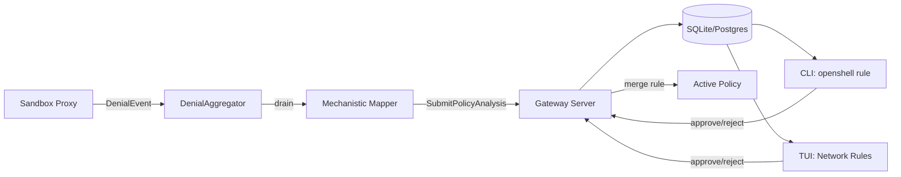
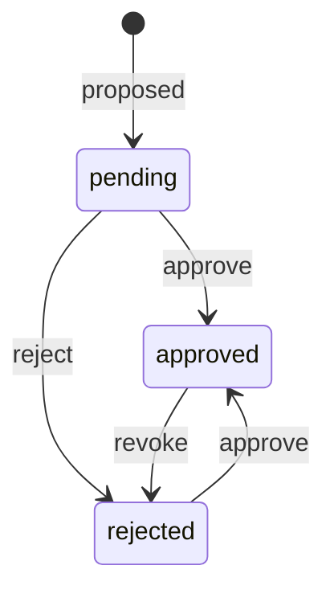

# Policy Advisor

The Policy Advisor is a recommendation system that observes denied connections in a sandbox and proposes policy updates to allow legitimate traffic. It operates as a feedback loop: denials are detected, aggregated, analyzed sandbox-side, and submitted to the gateway for the user to review and approve.

This document covers the plumbing layer (issue #204). The LLM-powered agent harness that enriches recommendations with context-aware rationale is covered separately (issue #205).

## Overview



The key architectural decision: **all analysis runs sandbox-side**. The gateway is a thin persistence + validation + approval layer. It never generates proposals or calls an LLM. Each sandbox handles its own analysis — N sandboxes = N independent pipelines, horizontal scale for free.

## Components

### Denial Aggregator (Sandbox Side)

The `DenialAggregator` (`crates/openshell-sandbox/src/denial_aggregator.rs`) runs as a background tokio task inside the sandbox supervisor. It:

1. Receives `DenialEvent` structs from the proxy via an unbounded MPSC channel
2. Deduplicates events by `(host, port, binary)` key with running counters
3. Periodically drains accumulated summaries, runs the mechanistic mapper, and submits proposals to the gateway via `SubmitPolicyAnalysis` gRPC

The flush interval defaults to 10 seconds (configurable via `OPENSHELL_DENIAL_FLUSH_INTERVAL_SECS`).

### Denial Event Sources

Events are emitted at four denial points in the proxy:

| Source | Stage | File | Description |
|--------|-------|------|-------------|
| CONNECT OPA deny | `connect` | `proxy.rs` | No matching network policy rule |
| CONNECT SSRF deny | `ssrf` | `proxy.rs` | Resolved IP is internal/private |
| FORWARD OPA deny | `forward` | `proxy.rs` | Forward proxy policy deny |
| FORWARD SSRF deny | `ssrf` | `proxy.rs` | Forward proxy SSRF check failed |

L7 (per-request) denials from `l7/relay.rs` are captured via tracing in the current implementation, with structured channel support planned for issue #205.

### Mechanistic Mapper (Sandbox Side)

The `mechanistic_mapper` module (`crates/openshell-sandbox/src/mechanistic_mapper.rs`) generates draft policy recommendations deterministically, without requiring an LLM:

1. Groups denial summaries by `(host, port, binary)` — one proposal per unique triple
2. For each group, generates a `NetworkPolicyRule` allowing that endpoint for that binary
3. Generates idempotent rule names via `generate_rule_name(host, port)` producing deterministic names like `allow_httpbin_org_443` — DB-level dedup handles uniqueness, no collision checking needed
4. Resolves each host via DNS; if any resolved IP is private (RFC 1918, loopback, link-local), populates `allowed_ips` in the proposed endpoint for the SSRF override
5. Computes confidence scores based on:
   - Denial count (higher count = higher confidence)
   - Port recognition (well-known ports like 443, 5432 get a boost)
   - SSRF origin (SSRF denials get lower confidence)
6. Generates security notes for private IPs, database ports, and ephemeral port ranges
7. If L7 request samples are present, generates specific L7 rules (method + path) with `protocol: rest` (TLS termination is automatic — no `tls` field needed). Plumbed but not yet fed data — see issue #205.

The mapper runs in `flush_proposals_to_gateway` after the aggregator drains. It produces `PolicyChunk` protos that are sent alongside the raw `DenialSummary` protos to the gateway.

### Gateway: Validate and Persist

The gateway's `SubmitPolicyAnalysis` handler (`crates/openshell-server/src/grpc.rs`) is deliberately thin:

1. Receives proposed chunks and denial summaries from the sandbox
2. Validates each chunk (rejects missing `rule_name` or `proposed_rule`)
3. Extracts `(host, port, binary)` from the proposed rule for the dedup key
4. Persists via upsert — `ON CONFLICT (sandbox_id, host, port, binary) DO UPDATE SET hit_count = hit_count + excluded.hit_count, last_seen_ms = excluded.last_seen_ms`
5. Notifies watchers so the TUI refreshes

The gateway does not store denial summaries (they are included in the request for future audit trail use but not persisted today). It does not run the mapper or any analysis.

### Persistence

Draft chunks are stored in the gateway database:

```sql
CREATE TABLE draft_policy_chunks (
    id              TEXT PRIMARY KEY,
    sandbox_id      TEXT NOT NULL,
    draft_version   INTEGER NOT NULL,
    status          TEXT NOT NULL DEFAULT 'pending',  -- pending | approved | rejected
    rule_name       TEXT NOT NULL,
    proposed_rule   BLOB NOT NULL,             -- protobuf-encoded NetworkPolicyRule
    rationale       TEXT NOT NULL DEFAULT '',
    security_notes  TEXT NOT NULL DEFAULT '',
    confidence      REAL NOT NULL DEFAULT 0.0,
    host            TEXT NOT NULL DEFAULT '',   -- denormalized for dedup
    port            INTEGER NOT NULL DEFAULT 0,
    binary          TEXT NOT NULL DEFAULT '',   -- per-binary granularity
    hit_count       INTEGER NOT NULL DEFAULT 1, -- accumulated real denial count
    first_seen_ms   INTEGER NOT NULL,
    last_seen_ms    INTEGER NOT NULL,
    created_at_ms   INTEGER NOT NULL,
    decided_at_ms   INTEGER
);

-- One active chunk per (sandbox, endpoint, binary).
CREATE UNIQUE INDEX idx_draft_chunks_endpoint
    ON draft_policy_chunks (sandbox_id, host, port, binary)
    WHERE status IN ('pending', 'approved', 'rejected');
```

Schema lives in `crates/openshell-server/migrations/{sqlite,postgres}/003_create_policy_recommendations.sql`.

### Per-Binary Granularity

Each `(sandbox_id, host, port, binary)` gets its own row. Two unrelated processes hitting the same endpoint (e.g. `python3` and a separately launched `curl` both denied for `ip-api.com:80`) produce two separate rules in the TUI. Approving one doesn't approve the other. When both are approved, they share the same `NetworkPolicyRule` in the active policy with two entries in the `binaries` list. Revoking one removes only that binary from the rule; if no binaries remain, the entire rule is removed.

Note: OPA's `binary_allowed` rule includes ancestor matching — a child process (e.g. curl spawned by python via `subprocess.run`) inherits its parent's network access because the parent binary appears in the child's `/proc` ancestor chain. This means a child process won't generate a separate denial for endpoints its parent is already approved for. Per-binary granularity is most visible when different binaries independently access distinct endpoints.

## Approval Workflow

Draft chunks follow a toggle model:



There is no "undo" — reject is the revoke. Re-denials of a rejected endpoint bump `hit_count` and `last_seen_ms` but don't change status.

### Approval Actions

| Action | CLI Command | gRPC RPC | Effect |
|--------|-------------|----------|--------|
| View rules | `openshell rule get <name>` | `GetDraftPolicy` | List pending/approved/rejected chunks |
| Approve one | `openshell rule approve <name> --chunk-id X` | `ApproveDraftChunk` | Merge rule into active policy, mark approved |
| Reject one | `openshell rule reject <name> --chunk-id X` | `RejectDraftChunk` | Mark rejected (no policy change) |
| Approve all | `openshell rule approve-all <name>` | `ApproveAllDraftChunks` | Bulk approve all pending chunks |
| History | `openshell rule history <name>` | `GetDraftHistory` | Show timeline of proposals and decisions |

### Policy Merge

When a chunk is approved, the server:

1. Decodes the chunk's `proposed_rule` (protobuf `NetworkPolicyRule`)
2. Fetches the current active `SandboxPolicy`
3. Looks up the rule by `rule_name` in `network_policies`:
   - If the rule exists, **appends** the chunk's binary to the rule's `binaries` list
   - If no rule exists, inserts the whole proposed rule
4. Persists a new policy revision with deterministic hash (optimistic retry up to 5 attempts on version conflicts)
5. Supersedes older policy versions
6. Notifies watchers (triggers sandbox policy poll)

When a chunk is revoked (approved → rejected), the server calls `remove_chunk_from_policy`:

1. Finds the rule by `rule_name`
2. Removes just this chunk's binary from the rule's `binaries` list
3. If no binaries remain, removes the entire rule
4. Persists a new policy revision

The sandbox picks up the new policy on its next poll cycle (default 10 seconds) and hot-reloads the OPA engine.

## User Interfaces

### CLI

The `openshell rule` command group provides review and approval:

```bash
# View pending recommendations
openshell rule get my-sandbox

# Approve a specific chunk
openshell rule approve my-sandbox --chunk-id abc123

# Approve all pending
openshell rule approve-all my-sandbox

# Reject a chunk
openshell rule reject my-sandbox --chunk-id xyz789
```

### TUI

The TUI sandbox screen includes a "Network Rules" panel accessible via `[r]` from the sandbox detail view. It displays:

- List of rules with endpoint, binary name (short), and status badge (pending/approved/rejected)
- Hit count and first/last seen timestamps
- Expanded detail popup with full binary path, rationale, security notes, and proposed rule

Keybindings are state-aware:
- **Pending** → `[a]` approve, `[x]` reject, `[A]` approve all
- **Approved** → `[x]` revoke
- **Rejected** → `[a]` approve

## Configuration

| Environment Variable | Default | Description |
|---------------------|---------|-------------|
| `OPENSHELL_DENIAL_FLUSH_INTERVAL_SECS` | `10` | How often the aggregator flushes and submits proposals |
| `OPENSHELL_POLICY_POLL_INTERVAL_SECS` | `10` | How often the sandbox polls for policy updates |

## Future Work (Issue #205)

The LLM PolicyAdvisor agent will run sandbox-side via `inference.local`:

- Wrap the mechanistic mapper with LLM-powered analysis
- Generate context-aware rationale explaining *why* each rule is recommended
- Group related denials into higher-level recommendations
- Detect patterns (e.g., "this looks like a pip install") and suggest broader rules
- Validate proposals against the local OPA engine before submission
- Progressive L7 visibility: Stage 1 audit-mode rules → Stage 2 data-driven L7 refinement
